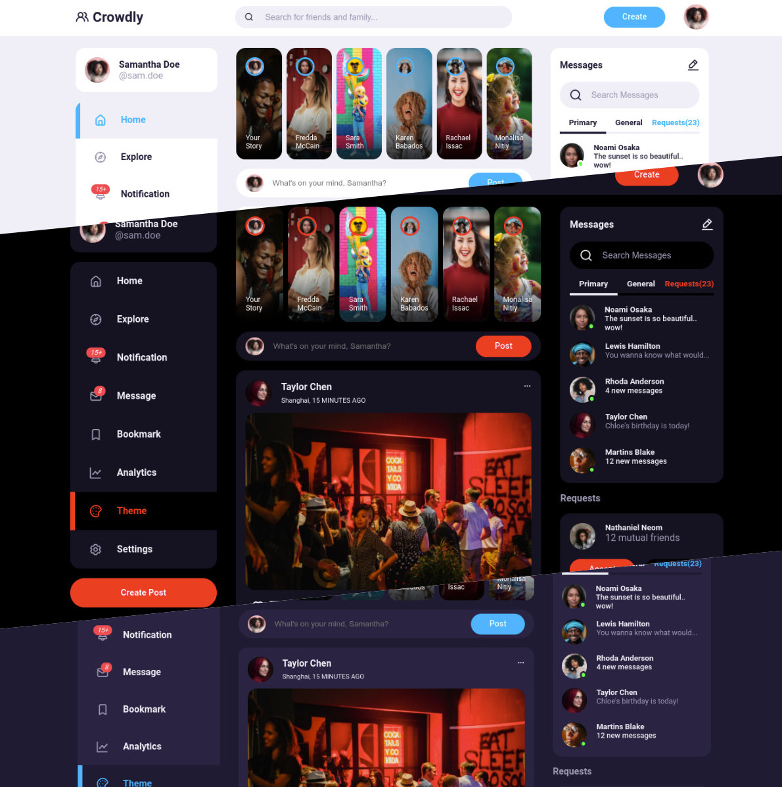

# Crowdly - A simple social media UI

## Introduction

A responsive social media UI with theme customization built using vanilla HTML5, CSS3 and JavaScript...Modern CSS3 features like CSS Variables, CSS Grid, CSS Flexbox, and CSS Units like rem, vw, and vh were used to achieve a Responsive Design.

A little project with modern design techniques for the astute frontend developer.

### Languages & Tools

1. **HTML5**
2. **CSS3**
3. **JavaScript**
4. Figma
